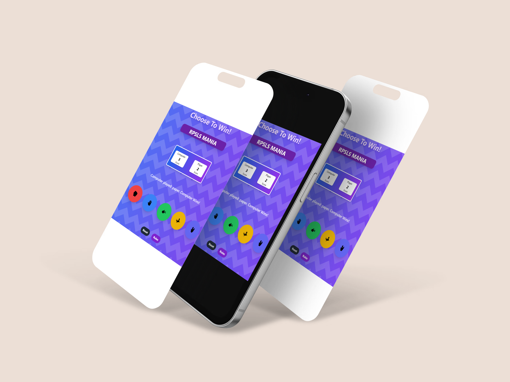
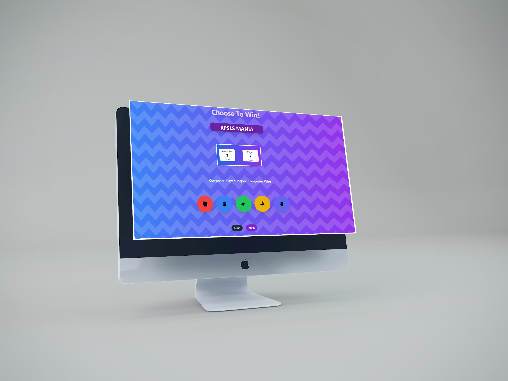

# Rock Paper Scissors Mania

## Description

Rock Paper Scissors Mania is a game where the player can choose to play rock, paper, scissors, lizard, or spock. The player's choice determines the outcome of the game. The game is won by the player who gets the most points.

## Objective

The objective of the game is to win the game by scoring the most points.

## How to play

1. The player can choose to play rock, paper, scissors, lizard, or spock.
2. The player's choice determines the outcome of the game.
3. The game is won by the player who gets the most points.

## Gameplay

- The player can choose to play rock, paper, scissors, lizard, or spock.
- The player's choice determines the outcome of the game.
- The game is won by the player who gets the most points.

# Preview

